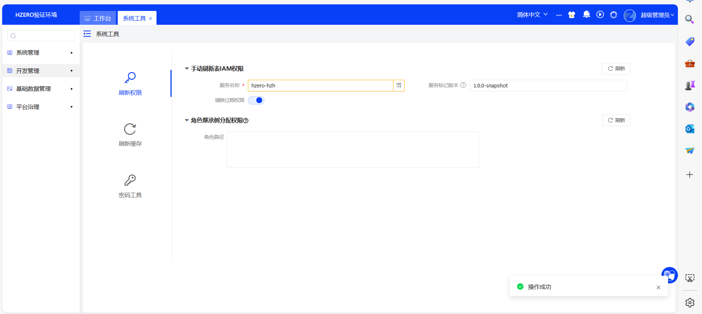

# 一、服务选配、启动成功、接口权限刷新、在swagger上测试成功

# 二、执行init-database脚本

# 三、猪齿鱼表设计、导出DDD脚本、DDL sql脚本，在swagger上能注册并测试成功

# 四、平台服务
## 1、租户创建、角色创建、菜单创建、子账户创建

## 2、值集配置、值集视图配置、可以预览LOV效果

## 3、编码规则配置，通过代码可以生成编码规则值

## 4、配置维护界面，通过代码可以获取配置维护的值

## 5、客户端创建、通过postman测试使用客户端获取token，并调用API接口

## 6、数据权限规则、权限范围设置。调用API接口查看权限规则是否生效，可通过debug模式打印sql

# 五、调度平台
## 1、执行器创建

## 2、调度任务创建

## 3、调度任务执行

## 4、调度任务客户端

# 六、通用导入
## 1、配置导入模板

## 2、模板类型=客户端时，引入通用导入客户端，通过代码实现自定义校验、自定义导入逻辑

## 3、模板类型=服务端时，直接导入数据到表里

# 七、消息管理
## 1、配置邮箱账户、消息模板、消息发送配置；测试发送消息给自己的邮箱

## 2、引入消息服务客户端，通过代码调用消息服务客户端，根据消息代码发送；根据消息类型+账号发送消息

# 八、文件服务
## 1、理解uuid和file的关系
UUID（Universally Unique Identifier）是一种用于确保全局唯一标识的标准格式。在文件上传过程中，如果存在相同文件名的情况，后上传的文件通常会覆盖先前的文件。为了避免这种冲突，可以将文件名后面附加一个UUID。

在系统中，每次上传操作都会生成一个不同的UUID。如果多个文件属于同一批次上传，它们可以共享相同的UUID。这样做有助于确保同一批次上传的文件不会出现重复的文件名问题。这个UUID可以作为文件名的一部分，以保持文件名的唯一性。这种方式可以有效避免文件覆盖和命名冲突的问题。
## 2、通过postman调用文件服务接口上传图片、PDF等；然后通过文件汇总查询信息

## 3、引入文件服务客户端，通过代码上传附件到文件服务中

# 九、报表平台
## 1、配置数据集、报表模板管理、报表定义

## 2、配置仪表板（简单表格、饼状图），发布成路由

## 3、到培训租户下，以“工号-姓名”创建一级目录，将页面表格、图形报表、仪表板路由挂到菜单上

# 十、流程平台
## 1、配置流程表单、流程定义、流程变量、审批人规则、审批表单

## 2、截图展示录入数据、待办审批、审批完成、修改表单单据状态

## 3、将报表平台配置的页面，或者仪表板页面作为审批表单，挂到流程里，并且能够加载出来，完成流程审批动作。
